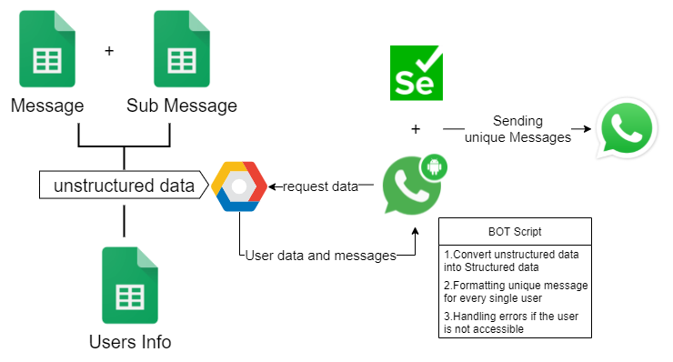
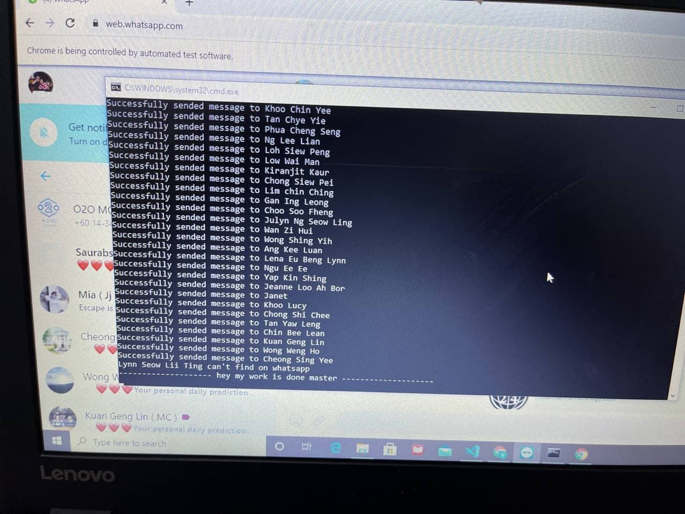

# WhatsApp Message sending automation Using selenium and GCP Services

* Understanding the client requirement and developing solution with no future cost this project helped a small company to send mass number of messages to users with the user concern.

* Using selenium and gcp api, data from gsheet and gdocs to access data from account and format a unique message according to user needs.

* By this application a single user can forward a unique formatted message to n number of users.

## System Design of the project

## Screen shot of the project

